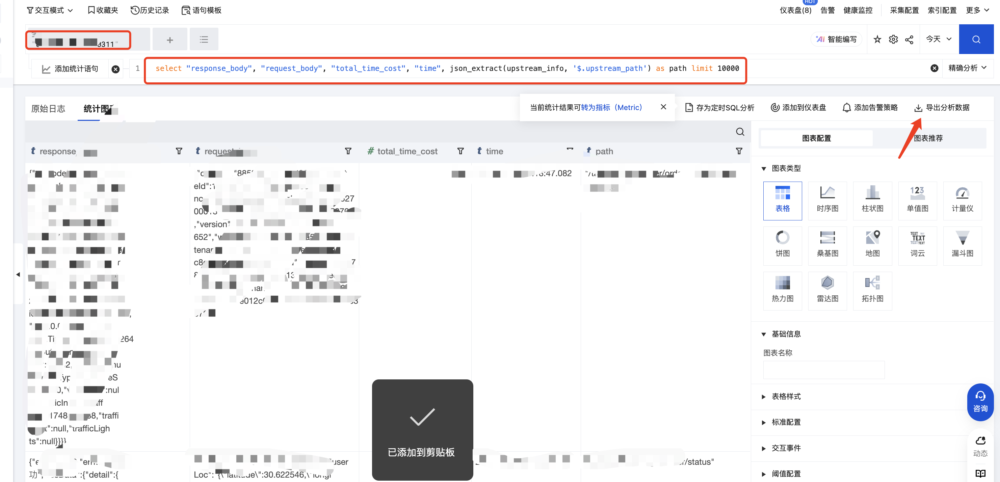

# cls2mock

## 快速开始

### 安装

```bash
npm i -g cls2mock
```

### 操作步骤

1、将cls日志导出成csv文件


```sql
select "response_body", "request_body", "total_time_cost", "time", substr(path, strpos(path, ' ')) as path
``` 
> 需要从cls日志中解析出`request_body`、`response_body`，`time`等信息后再导出

### 转换成本地mock数据

```bash
cls2mock xxx.csv
```
会在本地生成一个`mockData.zip`的包，解压后会有真实的用户请求数据再配合本地的mock代码进行使用
